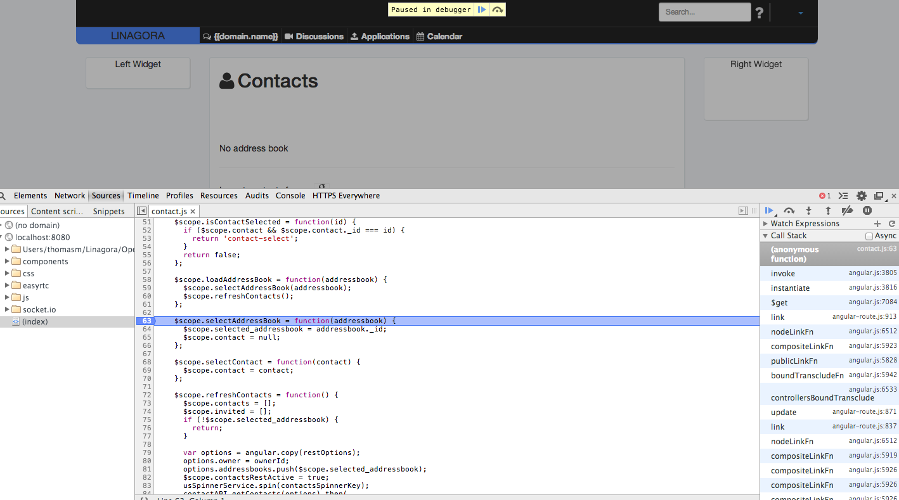
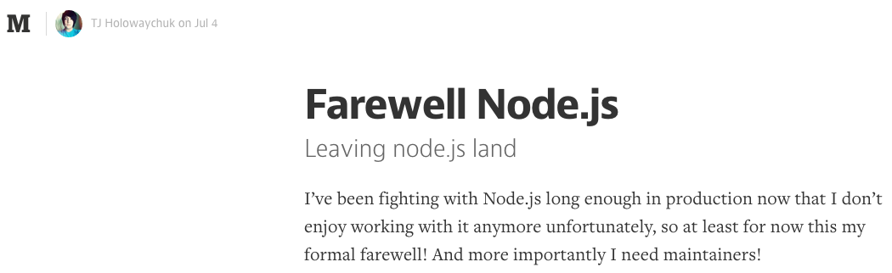

## #mylife

- Doctorat autour l'algorithmique distribuée (asynchrone) :
  - [ViSiDiA](http://visidia.labri.fr/html/home.html) : plateforme de simulation en Java
  - asynchrone ?
- Ingénieur R&D @Linagora :
  - Projets FP7 ([Play](http://www.play-project.eu/)) et ANR ([SocEDA](http://www.soceda.org/))
  - Java (backend et frontend) : GWT et Play Framework

 &nbsp;

-> développeur java orienté backend principalement
%%%

## Projet OpenPaaS RSE

- Réseau social à destination entreprises,
  - contraintes temps réel : notification, visioconférence, asynchronisme.

- Développement en JavaScript : Node.js
  - Express (backend)
  - Angular (frontend)

%%%

## Node.js

- Javascript coté serveur,
- Asynchrone,
- Moteur v8 de Chrome,
- Hors navigateur.

 &nbsp;

-> JavaScript : **trending** langage sur GitHub (devant Java)

%%%

**
Node.js is a platform built on Chrome's JavaScript runtime for easily building fast, scalable network applications.
Node.js uses an event-driven, non-blocking I/O model that makes it lightweight and efficient, perfect for data-intensive real-time applications that run across distributed devices.
**

%%%

## Qualités de Node.js

- Performance,
- Programmation non-itérative donc non bloquante,
- Portabilité (backend, frontend),
- Gestionnaire de paquets puissant (npm),
- Communauté active.

%%%

## Écosystème Node.js

- gestionnaire de modules backend : NPM,
- gestionnaire de modules frontend : Bower,
- frameworks : Express, Angular, Jade, Socket.io, Mocha, Grunt...

%%%

## Références en production

- Paypal (KrakenJS),
- Ebay (ql.io),
- LinkedIn (Mobile),
- Yahoo! (Cocktails),
- Mozilla
- ...

%%%

## Pas de problème !

- JavaScript/Node.js ? pas de problème j'utilise JQuery,
- Javascript/Angular ? pas de problème j'utilise déjà Bootstrap,
- Ce n'est pas typé ! pas de problème, je gère en PHP et Bash,
- Templating ? pas de problème, je connais Smarty.

%%%

## Prise de contact

- Utiliser JQuery != être compétent en JS,
- Compter 4 à 5 mois pour dompter les subtilités de Node.js,
- Langage non typé mais on peut faire de l'objet...

---
 &nbsp;

-> mais alors, dans quel pétrin me suis-je mis ?

%%%

## 1re Tentative(s), 1er Échec(s) : Async !

```
var my_client = new Client('myApp');
var member = null;

my_client.get('/member/'+ id, function(err, res){
  if(err){
    error(err.msg);
  }
  member = res.member;
});

my_client.updateMember(member.id, 'toto', function(res, err){
  if(err){
    error(err.msg);
  }
});

```

%%%

## 2ème Tentative(s), 2ème Échec(s) : Callback !

Quelque part côté backend...

```
function load(id, callback) {
  if (!id) {
    callback(new Error('Domain id is required'));
  }
  Domain.findOne({_id: id}, callback);
}

```
%%%

## 3ème Tentative(s), Brain Fuck !

```
my_client.get('/member/'+ id, function(err, res){
  if(err){
    error(err.msg);
  }
  my_client.updateMember(res.member.id, 'toto', function(res, err){
    if(err){
      error(err.msg);
    }
    my_client.XXX(..., function(...){
      my_client.YYY(..., function(...){

      }):
    });
  });
});
```

%%%

## Quelques amis

- Google (évidemment),
- ```console.log('Je passe ici !');``
- node-inspector : debugger JS (Chrome)
  - breackpoints,
  - stracktraces (tiens donc !),
  - console.

%%%


 &nbsp;

%%%

## Promesses

- Construire une suite d’actions (synchrones/asynchrones),
- Interrompre la suite si erreur sur une action,
- Compléter la suite même si erreur,
- Synchroniser plusieurs résultats asynchrones.


%%%

## Promesses (Exemple)
```
my_client.get('/member/id')
  .then(function(member){
    displayProfile(member);
    return my_client.get(member.avatar);
  }).then(function(avatar){
    displayAvatar(avatar);
  }).catch(function(err){
    error(err.msg);
  }).finally(function(){
    my_client.close();
  }).done();
};
```
%%%

## Async.js

```
async.waterfall(
  [
    function(callback) {
       fs.readFile(A, callback);
    },
    function(contentA, callback) {
       fs.readFile(B, function(err, contenuB) {
          callback(err, contentA, contentB);
       });
    },
    function(contentA, contentB, callback) {
       fs.writeFile(C, contentA + contentB, callback);
    },
  ],
  function(err) { console.log(err.msg); }
);
```

%%%

## Java 1 - 0 Node.js

- Node.js manque (encore) de standards de dév. :
  - **norme** projet from-scratch : [Yeoman](yeoman.io) (yo, grunt, bower),
  - tests : mocks difficiles ([mockery](https://github.com/mfncooper/mockery)).


- Node.js reste moins éprouvé que Java (et JEE),
- Equipe réduite :
  - OpenPaaS : environ 5 dév. JS,
  - Modules très souvents interdépendants.

%%%

## Java 1 - 1 Node.js

- Communauté :
  - jeune mais très active,
  - partage, collaboration (GitHub),
  - diffusion (NPM vs. Maven).
- Framework frontend et backend,
- Réinvention de la roue,
- ...

&nbsp;


%%%

## Objectivement

Le choix de Node.js doit être pesé :

&nbsp;

 - expérience utilisateur : temps réel ?
 - temps de calcul : calculs importants ?
 - exposition d'un API : multiplateforme et ouverture ?
 - nombre d'utilisateur : notion de bigdata ?
 - compétences développeur : JS-Master ? UI-designer ?
 - imposer une méthode de développement stricte : Scrum ?

%%%

## Subjectivement : Java 1 - 2 Node.js

- Javascript <3,
- JS côté serveur et client (vs. Java/JSP),
- Asynchronisme (difficile en Java),
- Temps-réel socket.io (en Java ?),
- Prototypage rapide : couple Angular/Bootstrap.

%%%

## Perpectives ?




%%%

# Merci!

- [@tmorsellino](http://twitter.com/tmorsellino)
- [https://github.com/linagora/openpaas-rse](https://github.com/linagora/openpaas-rse)
- [Slides](https://github.com/th0masm/talks/tree/master/content/rmll14-fr)
- [Linagora](http://linagora.com)
- [Linagora Labs](http://research.linagora.com)

%%%

- [@AwesomePaaS](https://twitter.com/AwesomePaaS)
- [@gSafe_Project](https://twitter.com/gsafe_project)